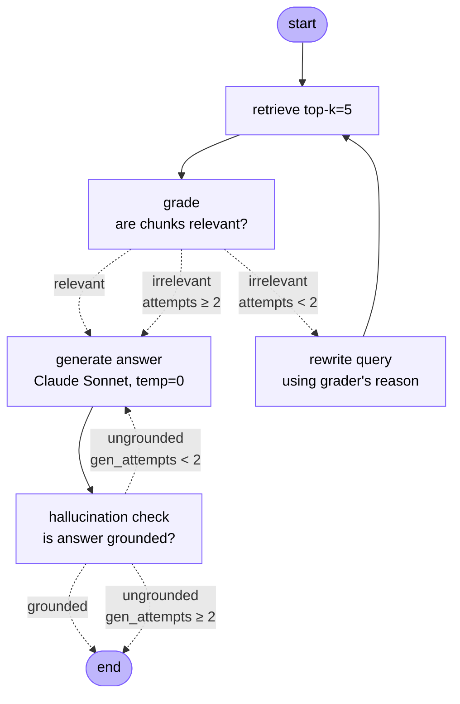

# soccer-tactics-rag

A compound AI workflow over a soccer-tactics corpus. Built three layers, in order: a naive RAG baseline, an evaluation harness, and an agentic self-correction loop implementing the Corrective RAG (CRAG) pattern from Yan et al. (2024). The ordering matters,the eval harness exists *before* the agentic layer so every piece of added complexity can be measured against the baseline rather than asserted on vibes.

The corpus is 20 Wikipedia articles covering tactics (gegenpressing, tiki-taka, catenaccio…), formations (4-3-3, 4-2-3-1, 3-5-2, 4-4-2), and player roles (sweeper-keeper, playmaker, false 9).

**Live demo:** *(deployment in progress, Streamlit on HF Spaces, see `DEPLOYMENT.md`)*

## What I built vs. what I used

To be clear about scope:

- **Built**: the LangGraph state machine (five nodes, two conditional edges, bounded retries on both retry paths), the ingestion pipeline (scraper with Wikipedia-aware chrome stripping, token-based chunker, Chroma index), the evaluation harness (10 ground-truth questions with keyword recall, retrieval hit-rate, and LLM-as-judge faithfulness metrics), and the Streamlit UI with verdict trace inspection.
- **Used**: LangGraph for graph orchestration, LangChain abstractions for provider swappability, Chroma for vector storage, OpenAI `text-embedding-3-small` for embeddings, Claude Sonnet 4.6 for generation and judging, GPT-4o-mini as a cross-family judge in the eval harness.
- **Followed**: the CRAG pattern (Yan et al. 2024) for the agentic structure: grade retrieval, rewrite on failure, check generation, regenerate on failure. The pattern is from the paper; the implementation in this codebase is mine.

## Architecture

### Ingestion (offline, runs once)

```
urls.txt → scraper.py → data/raw/*.txt
                ↓
   RecursiveCharacterTextSplitter
        (500 tokens, 50 overlap, cl100k_base)
                ↓
   OpenAI text-embedding-3-small (1536-dim)
                ↓
   Chroma (./chroma_db, collection: soccer_tactics)
```

### Agentic query graph (runtime)



Two independent self-checks, each catching a different failure mode:
- **Grader** runs *before* generation. Catches retrieval failure (the right chunks didn't come back). On failure, the rewriter reformulates the query using the grader's stated reason and retrieval runs again.
- **Hallucination checker** runs *after* generation. Catches generation failure (the right chunks came back, but the LLM ignored them or added unsupported claims). On failure, the generator runs again with the rejected answer and the checker's complaint as explicit corrective context.

Both retry paths are bounded at one extra attempt. After exhausting retries, the system returns the best answer it has with a `grounded: false` flag in the state so a calling system can decide what to do (warn the user, suppress the answer, escalate).

### Evaluation harness

```
evals/ground_truth.json (10 questions, expected keywords, expected topics)
                ↓
       evals/run_eval.py
                ↓
   keyword_recall · topic_hit · faithfulness (gpt-4o-mini judge)
                ↓
       evals/results.json (per-question scores)
```

## Stack and rationale

| Layer | Choice | Why |
|---|---|---|
| Embeddings | OpenAI `text-embedding-3-small` (1536-dim) | Cheap (~$0.02 / 1M tokens), strong baseline. Anthropic doesn't ship a first-party embedding model. |
| Vector DB | Chroma (local, persisted to disk) | Zero-ops for a prototype. The `langchain_chroma` interface is compatible with swapping to Pinecone or pgvector if the corpus grows past ~100k chunks. |
| Chunking | `RecursiveCharacterTextSplitter`, 500 tok / 50 overlap, token-based via `cl100k_base` | Real token counts, not character approximations. Recursive splitting tries paragraph → sentence → word boundaries to preserve semantic units. |
| Generator | Claude Sonnet 4.6, temperature 0 | Sonnet at temp 0 gives deterministic outputs, which is necessary for eval-harness reproducibility. |
| Grader / checker | Claude Sonnet 4.6, JSON output | Same model as the generator. Cost of running three Claude calls per agentic query is ~$0.02 and it's acceptable for the demo, would need cheaper judges (Haiku, gpt-4o-mini) at production scale. |
| Eval judge | OpenAI `gpt-4o-mini` | Cross-family using the same model to generate *and* judge correlates errors. A model is bad at noticing the kinds of mistakes it makes. |
| Orchestration | LangGraph | Conditional edges and explicit state make the control flow inspectable. Tracing through a graph is easier than tracing through nested `if` statements in one function. |

## Design decisions

These are the ones I'd defend in a technical conversation.

**Built the eval harness before the agentic layer.** A re-ranker, a rewriter, a hallucination checker, each adds latency and cost. Without a baseline measurement, "improvement" is just code accumulation. The harness lets me say which additions actually moved the needle and which got cut.

**Three metrics, not one.** `keyword_recall` (cheap, brittle, catches wholly wrong answers), `topic_hit` (isolates retrieval from generation), and LLM-judged `faithfulness` (catches hallucination). They fail differently: a high-faithfulness, low-keyword-recall answer is "wrong but well-grounded", a chunking or retrieval problem, while the inverse is a hallucination problem. A single aggregate metric would obscure this.

**Cross-family judge.** GPT-4o-mini judges Claude's output in the eval harness. Same-family judging is a known anti-pattern in the LLM-as-judge literature; models systematically fail to catch the kinds of errors they themselves produce. The cost difference between Claude-judging-Claude and gpt-4o-mini judging Claude is negligible (~$0.001/query); the methodological hygiene is worth it.

**Binary verdicts with reasons, not numeric scores.** Both the grader and the hallucination checker return `yes/no` + a one-line reason rather than a 0–1 float. LLMs are poorly calibrated at producing numerical confidence, there's no real signal in `0.7` vs `0.6`. Binary forces a commitment, and the reason field becomes input to the next node (the rewriter sees why the chunks were rejected; the regenerator sees why the answer was rejected). That feedback loop is the whole reason CRAG works.

**Bounded retries.** Max one rewrite, max one regeneration. Unbounded retry loops are how agentic systems run up $200 bills oscillating between near-duplicate states. One retry recovers from the common case (query phrasing, generator wandering off-context); a second wouldn't typically add value.

**Carried full history in graph state.** The state TypedDict tracks `query_history`, `grader_verdicts`, `answer_history`, and `hallucination_verdicts` not just current values. This makes the full decision trace inspectable downstream, which is what the Streamlit UI uses to show "the agent self-corrected" callouts. It also means the eval harness can score not just the final answer but how the graph got there.

**Chunk size 500, not 1000 or 200.** 500 tokens (~375 words, ~2 paragraphs of typical Wikipedia prose) is large enough to contain a self-contained idea but small enough to keep retrieval precise. The 50-token overlap exists so that a key phrase split mid-chunk ("false…nine") still appears intact in at least one of the adjacent chunks.

## Known limitations

- **10 eval questions is enough to catch regressions, not subtle drift.** Production-grade would be 100+ questions with deliberate adversarial cases (multi-hop, out-of-corpus, leading questions designed to elicit hallucination).
- **Keyword recall is brittle.** "Pep Guardiola" vs "Guardiola" vs "Josep Guardiola" all express the same fact; substring matching misses variants. Acceptable as a fast first-pass; the LLM judge handles the nuance.
- **Naive top-k retrieval, no re-ranking.** Top-5 cosine similarity often surfaces chunks that are topically close but not the most relevant for the specific question. A cross-encoder re-ranker would help; not yet built.
- **No routing.** Every question goes through the same retrieval path. A routing node that classifies questions into tactical-concept / formation / role buckets and queries metadata-filtered sub-collections would improve precision; not yet built.
- **Single judge model in evals.** Using one LLM to judge another correlates errors even across families. Production setups use multiple judges or human spot-checks on judge disagreements.