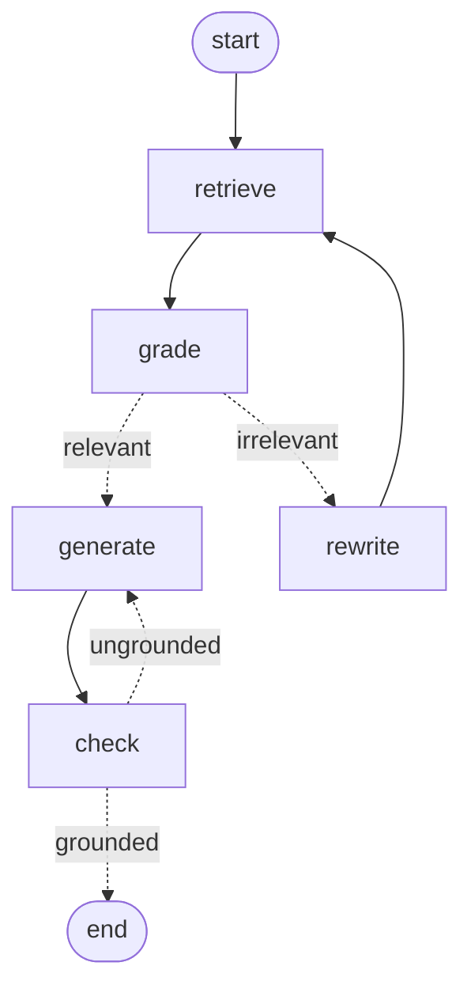

# soccer-tactics-rag

A compound AI workflow over a corpus of soccer tactical analysis, combining **retrieval-augmented generation, planned agentic orchestration, and an evaluation harness**. The corpus is 20 Wikipedia articles covering tactics, formations, and player roles.

The project is structured in three layers — naive RAG, agentic orchestration, evaluation — built in that order so each layer can be measured against the previous one.

## Architecture

```
┌─────────────────────────────────────────────────────────────────┐
│                       INGESTION (offline)                       │
│  urls.txt → scraper.py → data/raw/*.txt                         │
│                    ↓                                            │
│      RecursiveCharacterTextSplitter (500 tok, 50 overlap)       │
│                    ↓                                            │
│       OpenAI text-embedding-3-small (1536-dim vectors)          │
│                    ↓                                            │
│            Chroma (./chroma_db, collection: soccer_tactics)     │
└─────────────────────────────────────────────────────────────────┘

┌─────────────────────────────────────────────────────────────────┐
│                       QUERY (runtime)                           │
│   user question → embedding → Chroma top-k=5 → context block    │
│                              ↓                                  │
│              Claude Sonnet 4.6 (grounded prompt)                │
│                              ↓                                  │
│                          answer + sources                       │
└─────────────────────────────────────────────────────────────────┘

┌─────────────────────────────────────────────────────────────────┐
│                       EVALUATION                                │
│  evals/ground_truth.json (10 questions)                         │
│                              ↓                                  │
│     run_eval.py → keyword_recall, topic_hit, faithfulness       │
│                   (faithfulness via gpt-4o-mini LLM-as-judge)   │
│  evals/smoke_5q.py → 5-question end-to-end test of agentic graph│
└─────────────────────────────────────────────────────────────────┘
```

### Agentic graph (rendered from code)



Generated from `agentic_rag.build_graph().get_graph().draw_mermaid()` — this diagram is the source of truth; if the code changes, regenerate it.

### Status: layer 1 (naive RAG), layer 2 (full CRAG loop), layer 3 (evals) shipped

Layer 2 (**agentic orchestration**) implements the full Corrective RAG (CRAG, Yan et al. 2024) pattern:

- ✅ **LangGraph state machine** — five nodes (retrieve, grade, rewrite, generate, check) with two conditional edges
- ✅ **Document grader (pre-generation)** — Claude judges whether retrieved chunks can answer the question; binary verdict + one-line reason
- ✅ **Query rewriter** — on a "no" verdict, reformulates the query using the grader's reason as context, then retrieval runs once more (bounded: max one rewrite)
- ✅ **Hallucination checker (post-generation)** — Claude judges whether every claim in the generated answer is supported by the retrieved chunks
- ✅ **Informed regeneration** — on a "no" verdict from the checker, generates again with the previous (rejected) answer + the checker's complaint as explicit corrective context (bounded: max one regenerate)

Two independent self-checks catch two independent failure modes: bad retrieval (grader) and ungrounded generation (checker). Each has a bounded retry path. If after both retries the system still can't produce a grounded answer, the final state carries a `grounded: false` flag rather than crashing — a calling system can choose what to do (warn, suppress, escalate).

Still planned:

- **Routing** — classify questions into tactical-concept / formation / role buckets and route to specialized sub-retrievers
- **Re-ranking** — cross-encoder or LLM scorer to re-order top-k by query relevance before the generator sees them
- **Eval-harness comparison** — extend `run_eval.py` with `--agentic` to score the full graph against the naive baseline

## Stack

| Layer | Choice | Why |
|---|---|---|
| Embeddings | OpenAI `text-embedding-3-small` (1536-dim) | Cheap (~$0.02/1M tokens), strong baseline. Anthropic doesn't ship a first-party embedding model. |
| Vector DB | Chroma (local) | Zero-ops persistence to disk. Easy to swap for Pinecone/pgvector later — `langchain_chroma` is interface-compatible. |
| Chunking | `RecursiveCharacterTextSplitter`, 500 tok / 50 overlap | Token-based via `cl100k_base`. Tries paragraph → sentence → word boundaries to preserve semantic units. |
| Generator | Claude Sonnet 4.6, temperature 0 | Strongest cost/quality point in the Claude family. Temperature 0 for deterministic eval runs. |
| Judge | OpenAI `gpt-4o-mini` | Different family from the generator (reduces correlated-error risk). |
| Orchestration | LangChain | Swappability across providers without code rewrites. |

## Setup

```bash
python3.11 -m venv .venv && source .venv/bin/activate
pip install -r requirements.txt
cp .env.example .env
# put real keys in .env (never in .env.example)
```

## Build the index

```bash
python ingestion/scraper.py   # writes data/raw/*.txt (~20 files)
python ingestion/index.py     # builds chroma_db/, runs a smoke query
```

## Query

```bash
# Naive RAG (layer 1)
python rag.py "What is gegenpressing?"
python rag.py "How does a false nine differ from a target man?" --show-sources

# Agentic RAG (layer 2 — grader + rewriter + hallucination checker)
python agentic_rag.py "What is gegenpressing?"
python agentic_rag.py "Tell me about that thing where teams press right after losing the ball" --trace
```

```python
from rag import ask                     # naive
from agentic_rag import ask as ask_agentic   # graded + self-rewriting
```

## Evaluate

```bash
# Deterministic metrics only (free beyond the RAG calls themselves)
python evals/run_eval.py

# Add LLM-as-judge faithfulness (gpt-4o-mini, costs cents)
python evals/run_eval.py --judge --out evals/results.json

# 5-question end-to-end smoke test of the full agentic graph
# Reports which questions triggered a rewrite or a regeneration.
python evals/smoke_5q.py
```

See `evals/README.md` for what each metric measures and why.

## Layout

```
soccer-tactics-rag/
├── urls.txt                 # curated Wikipedia URLs
├── ingestion/
│   ├── scraper.py           # fetch + clean Wikipedia HTML → data/raw/*.txt
│   └── index.py             # chunk + embed + persist to chroma_db/
├── rag.py                   # ask() + CLI (naive RAG, layer 1)
├── agentic_rag.py           # LangGraph CRAG: grader + rewriter + hallucination checker (layer 2)
├── evals/                   # evaluation harness (layer 3)
│   ├── ground_truth.json    # 10 reference questions
│   ├── run_eval.py          # runner with deterministic + LLM-judge metrics
│   └── README.md            # explanation of metrics
├── data/raw/                # gitignored, populated by scraper
├── chroma_db/               # gitignored, populated by index
└── .env                     # gitignored, see .env.example
```

## Design decisions worth defending

1. **Naive RAG first, then evals, then agents.** Building the eval harness before adding agentic complexity means every "improvement" can be measured against a real baseline rather than asserted on vibes. This ordering also avoids over-engineering: a re-ranker that doesn't move the needle on the 10-question harness gets cut.

2. **Three metrics, not one.** `keyword_recall` (cheap, brittle), `topic_hit` (isolates retrieval), and LLM-judged `faithfulness` (catches hallucination) catch different failure modes. A high faithfulness with low keyword recall is a "wrong but well-grounded" answer — different bug, different fix — than the opposite case.

3. **Different model for the judge.** `gpt-4o-mini` judges Claude's output. Using the same model family for generation and judging correlates errors: a model is bad at noticing the kinds of mistakes it makes. Cross-family judging is a cheap hedge against that.

4. **Chunk size of 500 tokens, not 1000 or 200.** 500 is large enough to contain a self-contained idea (most Wikipedia paragraphs fit), small enough to retrieve precisely. The 50-token overlap prevents key phrases from getting split across boundaries.